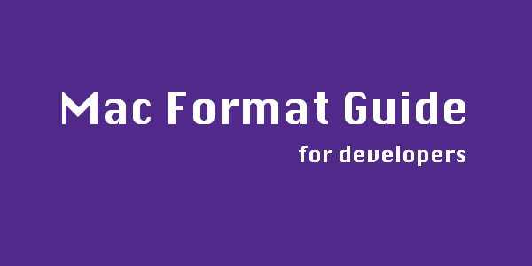

[](http://google.com.tr)

# First Of All

You'll start to install form [**`Xcode`**](https://itunes.apple.com/us/app/xcode/id497799835?mt=12).<br/>
You could accept the EULA (End User License Agreement) by running this terminal command. <br/>

```
sudo xcodebuild -license accept
```

After installing you need **`Xcode Command Line Tools.`** <br/>

```{r, engine='bash', count_lines}
xcode-select --install

**Enable command line tools**
sudo xcode-select --switch /Library/Developer/CommandLineTools

**End Reset command line tools**
sudo xcode-select --reset
```

Also you can download ofline version form [**`Apple Developer`**](http://developer.apple.com/xcode/downloads/). <br/>

**`Note : install on the Application folder`**

# Homebrew [](https://brew.sh/)

Installation Homebrew:

```{r, engine='bash', count_lines}
ruby -e "$(curl -fsSL https://raw.githubusercontent.com/Homebrew/install/master/install)"
```

Installation Homebrew Services:

```{r, engine='bash', count_lines}
brew tap homebrew/services
```

## More Info About Homebrew

- Serching anything `brew search XXXX`
- Getting info about anything `brew info XXXX`
- Fix any problem wants you `brew doctor`
- Clear and deleting all the outdated versions `brew cleanup`
- Deleting anyting `brew uninstall XXXX`
- Update and Upgrade any app or services `brew update && brew upgrade`
- Listing app or services `brew list`

# Yuu hoo! We Can Start All of Wants!

## Exporer

---

Installation any explorer:

```{r, engine='bash', count_lines}
brew cask install google-chrome
brew cask install firefox
brew cask install firefox-developer-edition
brew cask install opera
brew cask install opera-developer
brew cask install beaker-browser
```

## Editor

---

Installation any editor:

```{r, engine='bash', count_lines}
brew cask install visual-studio-code
brew cask install sublime-text
brew cask install sublime-text2
brew cask install atom
brew cask install brackets
brew cask install intellij-idea-ce
```

## Terminal

---

Installation any terminal:

```{r, engine='bash', count_lines}
brew cask install hyper
brew cask install upterm
brew cask install iterm2

## Shells
brew install fish
brew install zsh zsh-completions
brew install thefuck
```

## Database

---

Installation any database:

### [MongoDB](https://www.mongodb.com/)

Installation MongoDB:

```{r, engine='bash', count_lines}
brew install mongodb
```

Load and start the MongoDB service :

```{r, engine='bash', count_lines}
brew services start mongodb
```

Desktop Controller Apps;

```{r, engine='bash', count_lines}
brew cask install mongodb-compass
brew cask install robo-3t
```

### [PostgreSQL](https://www.postgresql.org/)

Installation PostgreSQL:

```{r, engine='bash', count_lines}
brew install postgresql
```

Download and run Postgres.app -- a free-standing database server that's super easy to install and start. Grab pgAdmin and install it.
Grab pgAdmin and install it.

### [SQLite](https://www.mongodb.com/)

brew install sqlite

# Essential Apps

---

1.  [Spectacle](https://www.spectacleapp.com/)
    Move and resize windows with ease

        brew cask install spectacle

1.  [Caffeine](http://lightheadsw.com/caffeine/)
    Caffeine is a tiny program that puts an icon in the right side of your menu bar. Click it to prevent your Mac from automatically going to sleep, dimming the screen or starting screen savers.

        brew cask install caffeine

1.  [Docker](https://www.docker.com/)
    Docker is an open platform for developers and sysadmins to build, ship, and run distributed applications, whether on laptops, data center VMs, or the cloud

        brew cask install docker

1.  [Franz](https://meetfranz.com/)
    Franz is your messaging app for WhatsApp, Facebook Messenger, Slack, HipChat, Telegram and many many more.

        brew cask install franz

1.  [Macs Fan Control](https://www.crystalidea.com/macs-fan-control)
    Monitor and control fans on Apple computers

        brew cask install macs-fan-control

1.  [Dash](https://kapeli.com/dash)
    Dash is an API Documentation Browser and Code Snippet Manager. Dash stores snippets of code and instantly searches offline documentation sets for 200+ APIs, 100+ cheat sheets and more. You can even generate your own docsets or request docsets to be included.

        brew cask install dash

# Some Packages and Aplications

```{r, engine='bash', count_lines}
brew install python3
brew cask install java
brew cask install skype
brew cask install 1password
brew cask install spotify
brew install node
brew install wget
brew install htop
brew cask install deluge
brew install aria2
brew install git
brew install git-flow-avh
brew install heroku
brew install awscli
brew cask install charles
brew cask install filezilla
brew install tree
brew cask install evernote
brew install ruby
brew install bash
brew cask install thunderbird
brew cask install dropbox
brew cask install wechat
brew cask install vlc
brew cask install slack
brew cask install skype
brew cask install the-unarchiver
brew cask install path-finder
brew cask install android-studio
brew cask install android-file-transfer
```

# Chrome Extensions

- [AdBlock](https://chrome.google.com/webstore/detail/gighmmpiobklfepjocnamgkkbiglidom)

- [Apollo Client Developer Tools](https://chrome.google.com/webstore/detail/jdkknkkbebbapilgoeccciglkfbmbnfm)

- [Autofill](https://chrome.google.com/webstore/detail/nlmmgnhgdeffjkdckmikfpnddkbbfkkk)

- [JavaScript and CSS Code Beautifier](https://chrome.google.com/webstore/detail/iiglodndmmefofehaibmaignglbpdald)

- [DevTools Author](https://chrome.google.com/webstore/detail/egfhcfdfnajldliefpdoaojgahefjhhi)

- [JSON Viewer](https://github.com/tulios/json-viewer)

- [Momentum](https://chrome.google.com/webstore/detail/laookkfknpbbblfpciffpaejjkokdgca)

- [React Developer Tools](https://chrome.google.com/webstore/detail/fmkadmapgofadopljbjfkapdkoienihi)

- [Redux DevTools](https://github.com/zalmoxisus/redux-devtools-extension)

- [Visual Event](https://chrome.google.com/webstore/detail/pbmmieigblcbldgdokdjpioljjninaim)

- [Take Webpage Screenshots Entirely](https://chrome.google.com/webstore/detail/mcbpblocgmgfnpjjppndjkmgjaogfceg)

- [Postman](https://chrome.google.com/webstore/detail/fhbjgbiflinjbdggehcddcbncdddomop)

- [Vue](https://chrome.google.com/webstore/detail/fhbjgbiflinjbdggehcddcbncdddomop)

# Visual Studio Code Settings

It will coming soon!

# Babel

It will coming soon!

# Pretier

It will coming soon!

# Git Config

    git config --global user.name "YOUR-GIT-NAME"
    git config --global user.email "YOUR-GIT-EMAIL"

# Hyper Config
```
vim ~/.hyper.js
```

```
// Future versions of Hyper may add additional config options,
// which will not automatically be merged into this file.
// See https://hyper.is#cfg for all currently supported options.

module.exports = {
  config: {
    // Choose either "stable" for receiving highly polished,
    // or "canary" for less polished but more frequent updates
    updateChannel: 'stable',

    // default font size in pixels for all tabs
    fontSize: 12,

    // font family with optional fallbacks
    fontFamily: 'Menlo, "DejaVu Sans Mono", Consolas, "Lucida Console", monospace',

    // terminal cursor background color and opacity (hex, rgb, hsl, hsv, hwb or cmyk)
    cursorColor: 'rgba(248,28,229,0.8)',

    // `BEAM` for |, `UNDERLINE` for _, `BLOCK` for █
    cursorShape: 'BLOCK',

    // set to true for blinking cursor
    cursorBlink: false,

    // color of the text
    foregroundColor: '#fff',

    // terminal background color
    backgroundColor: '#000',

    // border color (window, tabs)
    borderColor: '#333',

    // custom css to embed in the main window
    css: '',

    // custom css to embed in the terminal window
    termCSS: '',

    // set to `true` (without backticks) if you're using a Linux setup that doesn't show native menus
    // default: `false` on Linux, `true` on Windows (ignored on macOS)
    showHamburgerMenu: '',

    // set to `false` if you want to hide the minimize, maximize and close buttons
    // additionally, set to `'left'` if you want them on the left, like in Ubuntu
    // default: `true` on windows and Linux (ignored on macOS)
    showWindowControls: '',

    // custom padding (css format, i.e.: `top right bottom left`)
    padding: '12px 14px',

    // the full list. if you're going to provide the full color palette,
    // including the 6 x 6 color cubes and the grayscale map, just provide
    // an array here instead of a color map object
    colors: {
      black: '#000000',
      red: '#ff0000',
      green: '#33ff00',
      yellow: '#ffff00',
      blue: '#0066ff',
      magenta: '#cc00ff',
      cyan: '#00ffff',
      white: '#d0d0d0',
      lightBlack: '#808080',
      lightRed: '#ff0000',
      lightGreen: '#33ff00',
      lightYellow: '#ffff00',
      lightBlue: '#0066ff',
      lightMagenta: '#cc00ff',
      lightCyan: '#00ffff',
      lightWhite: '#ffffff'
    },

    // the shell to run when spawning a new session (i.e. /usr/local/bin/fish)
    // if left empty, your system's login shell will be used by default
    //
    // Windows
    // - Make sure to use a full path if the binary name doesn't work
    // - Remove `--login` in shellArgs
    //
    // Bash on Windows
    // - Example: `C:\\Windows\\System32\\bash.exe`
    //
    // Powershell on Windows
    // - Example: `C:\\WINDOWS\\System32\\WindowsPowerShell\\v1.0\\powershell.exe`
    shell: '/usr/local/bin/fish',

    // for setting shell arguments (i.e. for using interactive shellArgs: ['-i'])
    // by default ['--login'] will be used
    shellArgs: ['--login'],

    // for environment variables
    env: {},

    // set to false for no bell
    bell: 'SOUND',

    // if true, selected text will automatically be copied to the clipboard
    copyOnSelect: false,

    // if true, on right click selected text will be copied or pasted if no
    // selection is present (true by default on Windows)
    // quickEdit: true

    // URL to custom bell
    // bellSoundURL: 'http://example.com/bell.mp3',

    // for advanced config flags please refer to https://hyper.is/#cfg
    hypercwd: {
      initialWorkingDirectory: '~/Desktop/Projects'
    },
  },

  // a list of plugins to fetch and install from npm
  // format: [@org/]project[#version]
  // examples:
  //   `hyperpower`
  //   `@company/project`
  //   `project#1.0.1`
  plugins: [
    'hyper-one-dark',
    'hyper-statusline',
    'hypercwd'
  ],

  // in development, you can create a directory under
  // `~/.hyper_plugins/local/` and include it here
  // to load it and avoid it being `npm install`ed
  localPlugins: [],

  keymaps: {
    // Example
    // 'window:devtools': 'cmd+alt+o',
  }
};
```


## For fish shell

```
cd ~/.config/fish
vim config.fish
set normal (set_color normal)
set magenta (set_color magenta)
set yellow (set_color yellow)
set green (set_color green)
set red (set_color red)
set gray (set_color -o black)

# Fish git prompt
set __fish_git_prompt_showdirtystate 'yes'
set __fish_git_prompt_showstashstate 'yes'
set __fish_git_prompt_showuntrackedfiles 'yes'
set __fish_git_prompt_showupstream 'yes'
set __fish_git_prompt_color_branch yellow
set __fish_git_prompt_color_upstream_ahead green
set __fish_git_prompt_color_upstream_behind red

# Status Chars
set __fish_git_prompt_char_dirtystate '⚡'
set __fish_git_prompt_char_stagedstate '→'
set __fish_git_prompt_char_untrackedfiles '☡'
set __fish_git_prompt_char_stashstate '↩'
set __fish_git_prompt_char_upstream_ahead '+'
set __fish_git_prompt_char_upstream_behind '-'

# Prompts
function fish_prompt
  set last_status $status

  set_color $fish_color_cwd
  printf '%s >' (prompt_pwd)
  set_color normal

  printf '%s ' (__fish_git_prompt)

  set_color normal
end

# Alias
alias rmi "rm -i"

# Define alias in config file
alias rmi="rm -i"

# This is equivalent to entering the following function:
function rmi
    rm -i $argv
end

# Then, to save it across terminal sessions:
funcsave rmi
```
## Fish for VSCODE
Open __Setting__ and: 

````
"terminal.integrated.shell.osx": "/usr/local/bin/fish",
````
# [Eslint]()

## [Eslint airbnb](https://www.npmjs.com/package/eslint-config-airbnb)

```
yarn global add eslint
yarn global add eslint-plugin-import
yarn global add eslint-plugin-react
yarn global add eslint-plugin-jsx-a11y
eslint --version

module.exports = {
root: true,
parser: "babel-eslint",
parserOptions: {
ecmaVersion: 2017,
sourceType: 'module',
ecmaFeatures: {
"jsx": true
}
},
extends: [
'eslint:recommended',
'plugin:react/recommended'
],
env: {
browser: true,
es6: true,
"jest/globals": true,
"node": true
},
plugins: ['babel', 'react', 'jest'],
rules: {
"quotes": [2, "single", "avoid-escape"],
"indent": [2, 2],
"no-console": 0,
"strict": 0,
"no-unused-vars": 0,
"no-debugger": 0,
'no-fallthrough': 0,
"react/prop-types": 0
}
};
```

# [Prettier](https://github.com/obartra/prettierrc)

```
Format On Save

Respects editor.formatOnSave setting.

You can turn on format-on-save on a per-language basis by scoping the setting:

// Set the default
"editor.formatOnSave": false,
// Enable per-language
"[javascript]": {
"editor.formatOnSave": true
}
```

npm i prettier eslint-config-prettier eslint-plugin-prettier --save
npm install --save-dev eslint-config-prettier

npm install --save-dev prettier eslint-config-prettier eslint-plugin-prettier

# Application Settings

It will coming soon!

## http-server run with https

````
openssl req -newkey rsa:2048 -new -nodes -x509 -days 3650 -keyout key.pem -out cert.pem
http-server -S -C cert.pem -o
````

# The fuck
Open your config.fish file and paste :

````
# The fuck
thefuck --alias | source
````

# Mac Settings

## Geting Ip Address
````
ifconfig |grep inet
````

## Show/Hide Hidden Files 

````
# Showing
defaults write com.apple.finder AppleShowAllFiles YES;
killall Finder /System/Library/CoreServices/Finder.app

# Hideing
defaults write com.apple.finder AppleShowAllFiles NO;
killall Finder /System/Library/CoreServices/Finder.app

# alias

alias showFiles='defaults write com.apple.finder AppleShowAllFiles YES; killall Finder /System/Library/CoreServices/Finder.app'

alias hideFiles='defaults write com.apple.finder AppleShowAllFiles NO; killall Finder /System/Library/CoreServices/Finder.app'

showFiles
hideFiles

# Mojave Dark Mode : Font Rendering issue:
defaults write -g CGFontRenderingFontSmoothingDisabled -bool FALSE


````

# For Science

brew install r
brew cask install rstudio
brew cask install texmacs
brew cask install matlab
brew tap caskroom/cask
brew tap homebrew/science
